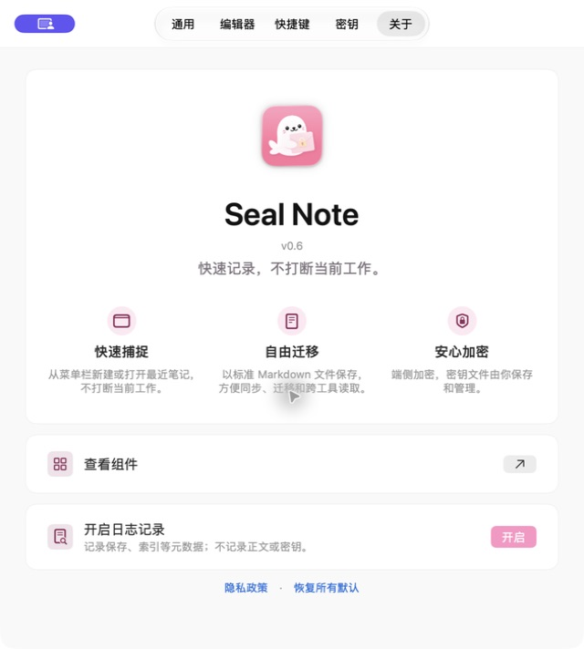
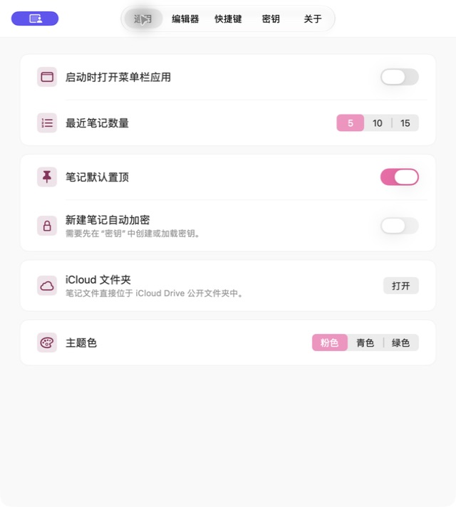

<p align="center">
  
</p>

<h1 align="center">Seal Note</h1>

<p align="center">
  快速记录，不打断当前工作。<br>
  一款支持 iCloud 同步与端侧加密的 Apple 平台 Markdown 便签应用。
</p>

<p align="center">
  <a href="https://github.com/XuWeinan123/EncryptNotes_for_TRAE/releases">下载最新版本</a>
  ·
  <a href="PRIVACY.md">隐私政策</a>
  ·
  <a href="https://github.com/XuWeinan123/EncryptNotes_for_TRAE/issues">反馈问题</a>
</p>



## 为什么是 Seal Note

- **快速捕捉**：macOS 菜单栏常驻，通过全局快捷键随时唤起悬浮便签。
- **自由迁移**：每篇笔记都是带 YAML frontmatter 的标准 Markdown 文件，不依赖私有数据库。
- **安心加密**：可选择仅加密敏感笔记的正文；加解密均在设备端完成。
- **自然同步**：优先使用 iCloud Drive，同一 Apple Account 下跨设备同步；iCloud 不可用时回退到本地存储。
- **原生体验**：SwiftUI 与 AppKit 构建，支持 Markdown 编辑/预览、搜索、标签、回收站、主题与自定义快捷键。

## 产品界面

<table>
  <tr>
    <td width="50%"></td>
    <td width="50%"></td>
  </tr>
  <tr>
    <td align="center">产品介绍与核心能力</td>
    <td align="center">原生 macOS 设置与主题</td>
  </tr>
</table>

## 平台与要求

| Target | 平台 | 最低版本 | 形态 |
| --- | --- | --- | --- |
| `EncryptNotesMac` | macOS | macOS 26 | 菜单栏应用 + 独立悬浮便签窗口 |
| `EncryptNotes` | iOS | iOS 17 | SwiftUI 卡片笔记应用 |

当前主要开发与分发体验面向 macOS。

## 数据与安全

Seal Note 不要求注册账号，也不包含广告、用户追踪或第三方分析 SDK。

每篇笔记保存为 `<noteId>.md`：YAML frontmatter 记录笔记 ID 与时间戳，正文保存 Markdown 内容。选择加密后，正文使用 256 位密钥和 AES-GCM 加密，并以 `snenc:v1:` 格式落盘；用于文件识别与同步的 frontmatter 不加密。

密钥保存在本机 Keychain，并可由用户导出或导入。Seal Note 无法恢复遗失的密钥，请妥善保存导出的密钥文件。明文笔记不会加密，不应存放敏感内容。完整说明请阅读[隐私政策](PRIVACY.md)。

```text
Markdown 正文
    ↓ 设备端 AES-GCM
snenc:v1:<base64url 密文>
    ↓ 写入独立 .md 文件
iCloud Drive / 本地存储
```

## 本地构建

项目是纯 Xcode 工程，使用 Swift 5；依赖由 Xcode 的 Swift Package Manager 自动解析。

```bash
git clone https://github.com/XuWeinan123/EncryptNotes_for_TRAE.git
cd EncryptNotes_for_TRAE

# 构建、启动并验证 macOS 应用进程
DEVELOPER_DIR=/Applications/Xcode-beta.app/Contents/Developer \
  ./script/build_and_run.sh --verify
```

也可以直接构建 macOS Scheme：

```bash
DEVELOPER_DIR=/Applications/Xcode-beta.app/Contents/Developer \
  xcodebuild \
  -project EncryptNotes.xcodeproj \
  -scheme EncryptNotesMac \
  -destination 'platform=macOS' \
  build
```

运行 iOS 测试：

```bash
DEVELOPER_DIR=/Applications/Xcode-beta.app/Contents/Developer \
  xcodebuild test \
  -project EncryptNotes.xcodeproj \
  -scheme EncryptNotes \
  -destination 'platform=iOS Simulator,name=iPhone 17'
```

## 项目结构

```text
EncryptNotes/
├── App/                 # iOS / macOS 应用入口
├── Crypto/              # AES-GCM 与 Keychain 密钥管理
├── Models/              # Note、Markdown 文件与索引模型
├── Storage/             # iCloud 与本地文件存储
├── Stores/              # VaultStore 及平台状态
├── Views/               # SwiftUI 共享界面
└── Views/Mac/           # 菜单栏、便签窗口、设置与列表
```

`VaultStore` 是笔记状态的单一事实来源；`VaultStorage` 抽象 iCloud 与本地文件系统；`NoteIndex` 负责保持笔记清单、位置与废纸篓元数据同步。

## 隐私承诺

- 不要求账号
- 不接入广告或追踪
- 不上传笔记正文或加密密钥给开发者
- 维护日志默认关闭，且不记录正文或密钥
- 笔记文件始终由用户自己的设备与 iCloud Drive 管理

如需报告安全问题或缺陷，请通过 [GitHub Issues](https://github.com/XuWeinan123/EncryptNotes_for_TRAE/issues) 联系，并避免在公开 Issue 中附上笔记正文或密钥。
